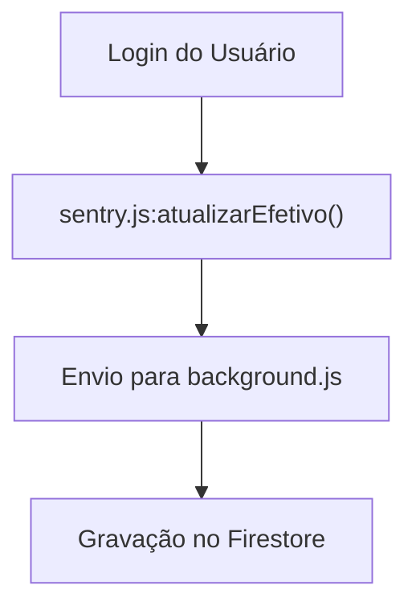
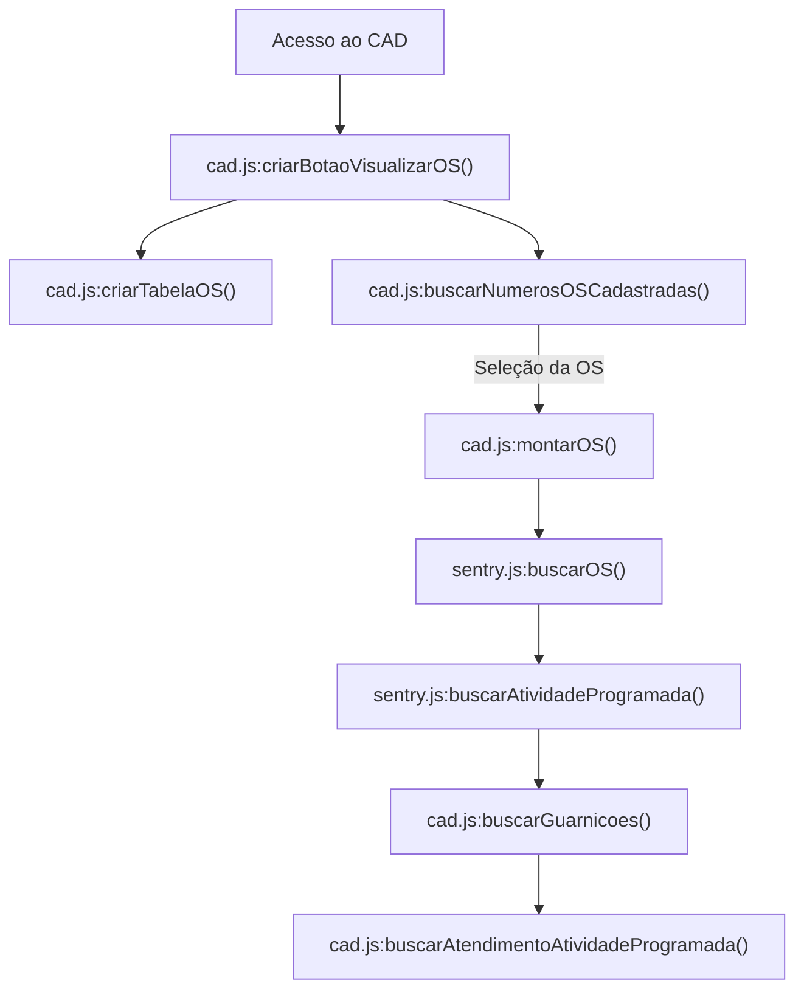
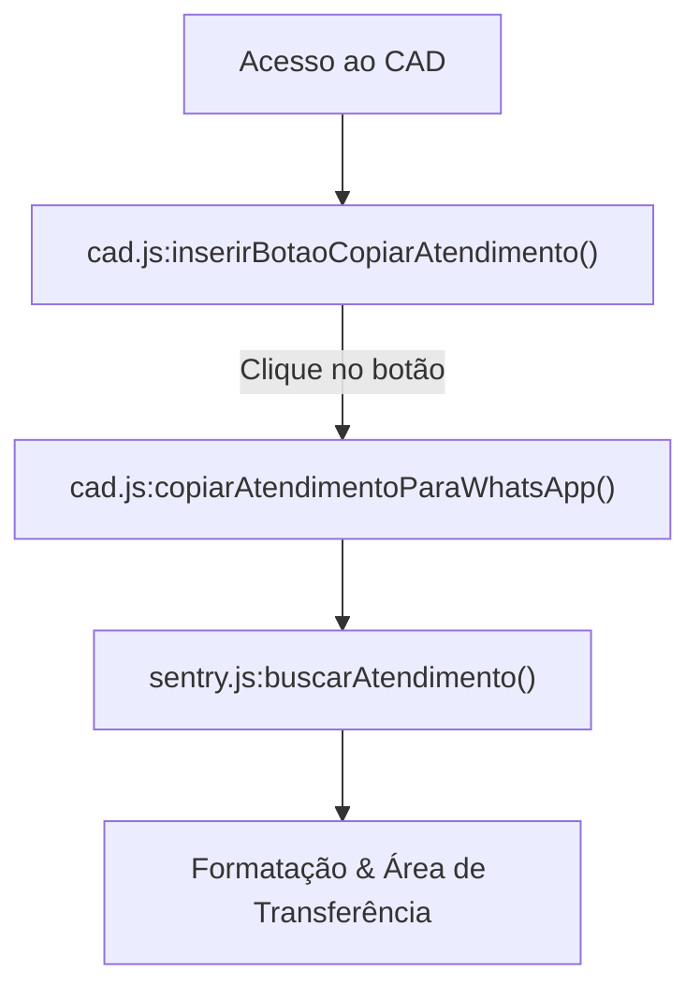
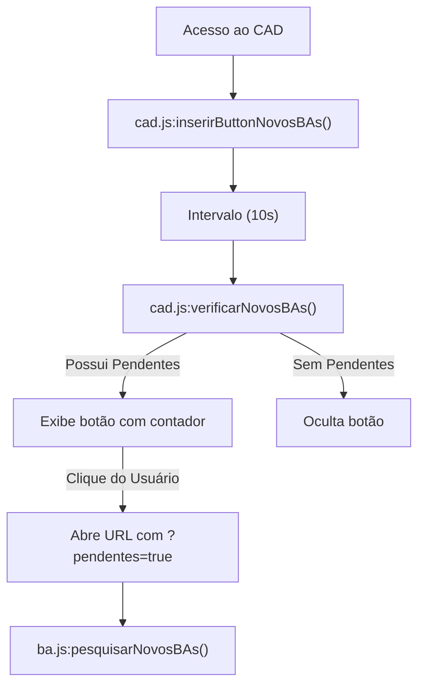

# XCAD GCM-POA

Extensão voltada para automatizar tarefas de diversos sistemas utilizados pela GCM-POA


## Sistemas alcançados

* **Sinesp CAD:** Criação de chamados pré-preenchidos, modelos de relatos e personalização de telas.
* **Consultas Integradas:** Fluxo de consulta automatizado e criação de formulário de resposta resumido.
* **Sentry:** Criação de chamados pré-preenchidos, assistente de correção de boletins, inserção de atividade programadas.


## Como Instalar

### Via Loja Oficial
* [Link para a Chrome Web Store](https://chromewebstore.google.com/detail/fdbjciigbhgllkgplmhmpilgigkdeghg?utm_source=item-share-cb)

### Instalação Manual (Modo Desenvolvedor)
1. Baixe ou clone este repositório:
   ```bash
   git clone https://github.com/DP3D3733/XCAD.git
2. Abra o navegador e acesse a página de extensões:

    - Chrome: chrome://extensions/

3. Ative o Modo do desenvolvedor (no canto superior direito).

4. Clique em Carregar sem compactação (Load unpacked) e selecione a pasta da extensão.

## Tecnologias Utilizadas
- HTML5 / CSS3 / JavaScript
- Manifest V3

## Estrutura
<details>
<summary><b>Ver estrutura de arquivos:</b></summary>

```text
XCAD/
├── assets/                     # Assets utilizados
│   └── icon.png
|
├── popup/                      # Interface de ativação/desativação de scripts
│   ├── popup.html
│   └── popup.js
|
├── background/                 # Scripts em background
│   ├── background.js               # Service Worker
│   └── modules/                    # Módulos de background
│       └── consultas.js                # Fluxo de Consultas Integradas
|
├── content/                    # Scripts da camada de janela
│   ├── content.js                  # Gerencia a injeção de scripts
│   ├── cercamento/                 # Cercamento Eletrônico
│   |   └── loginAutoProcempa.js 
│   |       
│   ├── consultas/                  # Consultas Integradas
│   |   ├── abas_acoes.js               # Acessa os botões nas abas
│   |   ├── cnj.js                      # Recebe e consulta o mandado
│   |   ├── dados_basicos.js            # Lê os dados básicos
│   |   ├── img.js                      # Busca a foto do indiv. e monta a resposta
│   |   ├── inicio.js                   # Pula a tela inicial e retorna ao infoseg
│   |   ├── menu_lateral.js             # Acessa os botões do menu
│   |   ├── ocorrencias.js              # Lê os dados de ocorrências
│   |   ├── pega_nome.js                # Seleciona o indivíduo correto na lista
│   |   ├── pesquisa_nome.js            # Pesquisa o indivíduo
│   |   └── veiculos.js                 # Lê e monta a resposta
│   |   
│   ├── psg_servico/                # Forms de Pass. de Sv do Ch. da Sala
│   |   └── formulario_psg_gs.js        # Preench. rápido e rel. antes de enviar
│   |   
│   ├── sinesp/                     # Sinesp CAD e Infoseg
│   |   ├── discover.js                 # Ajuste em algumas informações
│   |   ├── edicao.js                   # Col. de dados do Sentry e rel. padr.
│   |   ├── equipes.js                  # Preench. rápido de equipes e relatório
│   |   ├── infoseg.js                  # Busca, recebe e monta a resp. consultas
│   |   └── ocorrencias.js              # Funções no CAD Ocorrências
│   |   
│   ├── whatsapp/                   # WhatsApp Web
│   |   └── whatsapp.js    
│   |   
│   └── whu/                        # WHU
│       └── whu.js                      # Notificação de novos chamados
|
├── libs/                       # Bibliotecas externas
│   ├── firebase-app-compat.js      
│   ├── firebase-firestore-compat.js
│   ├── jszip.js
│   └── versiculos.json
|
├── web_accessible_resources/   # Scripts injetados na página
│   ├── atendimento.js              # Sentry - Modelos na pág. de atendimento
│   ├── ba.js                       # Sentry - Assist. Corr. BA
│   ├── cad.js                      # Sentry - Tela do CAD
│   ├── despacho.js                 # Sentry - Copiar Desp. P/ CAD e Ajuste de Hor.
│   ├── despachos.js                # Sentry - Cópia de info padronizadas
│   ├── efetivo.js                  # Sentry - Coleta de efetivo atualizado
│   ├── guarnicoes.js               # Sentry - Cópia de info padronizadas
│   ├── individuo.js                # Sentry - Preench. rápido
│   ├── os.js                       # Sentry - Preench. rápido atividades prog.
│   ├── relatorioPrometa.js         # Sentry - Rel. personalizado
│   └── sentry.js                   # Sentry - Inserção funções compartilhadas
|
└── manifest.json               # Configuração da extensão
```
</details>

## Funções
### Sentry
<details>
<summary>Atualizar Efetivo no Firestore</summary>

### Fluxo de Execução

1. **Autenticação:** O usuário faz login no Sentry.
2. **Sincronização de Dados:** A função [`sentry.js:atualizarEfetivo()`](https://github.com/DP3D3733/XCAD/blob/main/web_accessible_resources/sentry/sentry.js#L5-L42) faz o download do efetivo atualizado.
3. **Persistência:** A mensagem é enviada ao script de background (`background.js`), que realiza a gravação do efetivo no Firestore.

| Etapa | Ação | Função / Arquivo Chamado |
| :---: | :--- | :--- |
| **1** | Captura do Efetivo | [`sentry.js:atualizarEfetivo()`](https://github.com/DP3D3733/XCAD/blob/main/web_accessible_resources/sentry/sentry.js#L5-L42) |
| **2** | Processamento | `background/background.js` (`message.action == 'atualizar_efetivo'`) |
| **3** | Gravação | Banco de Dados (Firestore) |


</details>

<details>
<summary>Buscar OS (Ordem de Serviço)</summary>

### Fluxo de Execução

1. **Inicialização:** O usuário acessa a Central de Atendimento e Despacho (CAD) do Sentry.
2. **Construção da Interface:** A função [`cad.js:criarBotaoVisualizarOS()`](https://github.com/DP3D3733/XCAD/blob/main/web_accessible_resources/sentry/cad.js#L8-L90) gera o botão e o modal da OS, chamando [`cad.js:criarTabelaOS()`](https://github.com/DP3D3733/XCAD/blob/main/web_accessible_resources/sentry/cad.js#L222-L382) para estruturar a tabela e [`cad.js:buscarNumerosOSCadastradas()`](https://github.com/DP3D3733/XCAD/blob/main/web_accessible_resources/sentry/cad.js#L386-L422) para popular o seletor.
3. **Seleção:** O usuário clica no botão e escolhe uma OS no seletor.
4. **Montagem dos Dados:** A função [`cad.js:montarOS()`](https://github.com/DP3D3733/XCAD/blob/main/web_accessible_resources/sentry/cad.js#L120-L220) executa as consultas necessárias:
   * Busca as atividades da OS via [`sentry.js:buscarOS()`](https://github.com/DP3D3733/XCAD/blob/main/web_accessible_resources/sentry/sentry.js#L207-L231).
   * Detalha cada atividade via [`sentry.js:buscarAtividadeProgramada()`](https://github.com/DP3D3733/XCAD/blob/main/web_accessible_resources/sentry/sentry.js#L113-L127).
   * Mapeia as guarnições via [`cad.js:buscarGuarnicoes()`](https://github.com/DP3D3733/XCAD/blob/main/web_accessible_resources/sentry/cad.js#L424-L455).
   * Checa o cumprimento via [`cad.js:buscarAtendimentoAtividadeProgramada()`](https://github.com/DP3D3733/XCAD/blob/main/web_accessible_resources/sentry/cad.js#L457-L471) e popula a tabela.

| Etapa | Ação | Função / Arquivo Chamado |
| :---: | :--- | :--- |
| **1** | Criar Botão/Modal | [`cad.js:criarBotaoVisualizarOS()`](https://github.com/DP3D3733/XCAD/blob/main/web_accessible_resources/sentry/cad.js#L8-L90) |
| **2** | Estruturar Tabela | [`cad.js:criarTabelaOS()`](https://github.com/DP3D3733/XCAD/blob/main/web_accessible_resources/sentry/cad.js#L222-L382) |
| **3** | Popular Seletor | [`cad.js:buscarNumerosOSCadastradas()`](https://github.com/DP3D3733/XCAD/blob/main/web_accessible_resources/sentry/cad.js#L386-L422) |
| **4** | Processar OS | [`cad.js:montarOS()`](https://github.com/DP3D3733/XCAD/blob/main/web_accessible_resources/sentry/cad.js#L120-L220) |
| **5** | Consultar Atividades | [`sentry.js:buscarOS()`](https://github.com/DP3D3733/XCAD/blob/main/web_accessible_resources/sentry/sentry.js#L207-L231) |
| **6** | Detalhar Atividades | [`sentry.js:buscarAtividadeProgramada()`](https://github.com/DP3D3733/XCAD/blob/main/web_accessible_resources/sentry/sentry.js#L113-L127) |
| **7** | Guarnições Ativas | [`cad.js:buscarGuarnicoes()`](https://github.com/DP3D3733/XCAD/blob/main/web_accessible_resources/sentry/cad.js#L424-L455) |
| **8** | Verificar Cumprimento | [`cad.js:buscarAtendimentoAtividadeProgramada()`](https://github.com/DP3D3733/XCAD/blob/main/web_accessible_resources/sentry/cad.js#L457-L471) |


</details>

<details>
<summary>Copiar Atendimento P/ Área de Transferência</summary>

### Fluxo de Execução

1. **Inicialização:** O usuário acessa a Central de Atendimento e Despacho (CAD) do Sentry.
2. **Injeção do Botão:** A função [`cad.js:inserirBotaoCopiarAtendimento()`](https://github.com/DP3D3733/XCAD/blob/main/web_accessible_resources/sentry/cad.js#L473-L487) insere uma ação de cópia no menu de contexto dos atendimentos.
3. **Ação de Cópia:** Ao clicar no botão, a função [`cad.js:copiarAtendimentoParaWhatsApp()`](https://github.com/DP3D3733/XCAD/blob/main/web_accessible_resources/sentry/cad.js#L820-L890) consulta os dados via [`sentry.js:buscarAtendimento()`](https://github.com/DP3D3733/XCAD/blob/main/web_accessible_resources/sentry/sentry.js#L308-L321), formata o texto e escreve no clipboard do usuário.

| Etapa | Ação | Função / Arquivo Chamado |
| :---: | :--- | :--- |
| **1** | Injeção no Menu | [`cad.js:inserirBotaoCopiarAtendimento()`](https://github.com/DP3D3733/XCAD/blob/main/web_accessible_resources/sentry/cad.js#L473-L487) |
| **2** | Disparo da Cópia | [`cad.js:copiarAtendimentoParaWhatsApp()`](https://github.com/DP3D3733/XCAD/blob/main/web_accessible_resources/sentry/cad.js#L820-L890) |
| **3** | Consulta do Atendimento | [`sentry.js:buscarAtendimento()`](https://github.com/DP3D3733/XCAD/blob/main/web_accessible_resources/sentry/sentry.js#L308-L321) |


</details>

<details>
<summary>Notificação e Consulta de BAs Pendentes</summary>

### Fluxo de Execução

1. **Inicialização:** O usuário acessa a Central de Atendimento e Despacho (CAD) do Sentry.
2. **Criação da Interface:** A função [`cad.js:inserirButtonNovosBAs()`](https://github.com/DP3D3733/XCAD/blob/main/web_accessible_resources/sentry/cad.js#L892-L924) adiciona um botão no canto superior direito da tela com um ícone de arquivo e um contador.
3. **Polling (Ciclo de Checagem):** É iniciado um intervalo contínuo de 10 segundos chamando a função [`cad.js:verificarNovosBAs()`](https://github.com/DP3D3733/XCAD/blob/main/web_accessible_resources/sentry/cad.js#L926-L956).
4. **Atualização do Contador:** 
   * A função faz requisição ao endpoint de BAs filtrando por "Pendentes".
   * Se houver BAs pendentes, exibe o botão e atualiza a quantidade no badge.
   * Se não houver BAs pendentes, oculta o botão.
5. **Ação do Usuário:** Ao clicar no botão, é aberta a URL `sentry.procempa.com.br/web/bos?pendentes=true`.
6. **Filtragem Automática:** A query `pendentes=true` na URL engatilha a execução da função [`ba.js:pesquisarNovosBAs()`](https://github.com/DP3D3733/XCAD/blob/main/web_accessible_resources/sentry/ba.js#L446-L455), que seleciona o filtro "Pendentes" e executa a busca na página.

| Etapa | Ação | Função / Arquivo Chamado |
| :---: | :--- | :--- |
| **1** | Interface | [`cad.js:inserirButtonNovosBAs()`](https://github.com/DP3D3733/XCAD/blob/main/web_accessible_resources/sentry/cad.js#L892-L924) |
| **2** | Polling | [`cad.js:verificarNovosBAs()`](https://github.com/DP3D3733/XCAD/blob/main/web_accessible_resources/sentry/cad.js#L926-L956) |
| **3** | Busca | [`ba.js:pesquisarNovosBAs()`](https://github.com/DP3D3733/XCAD/blob/main/web_accessible_resources/sentry/ba.js#L446-L455) |


</details>