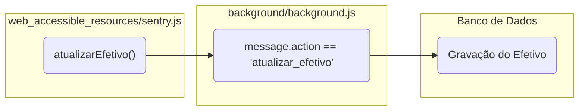
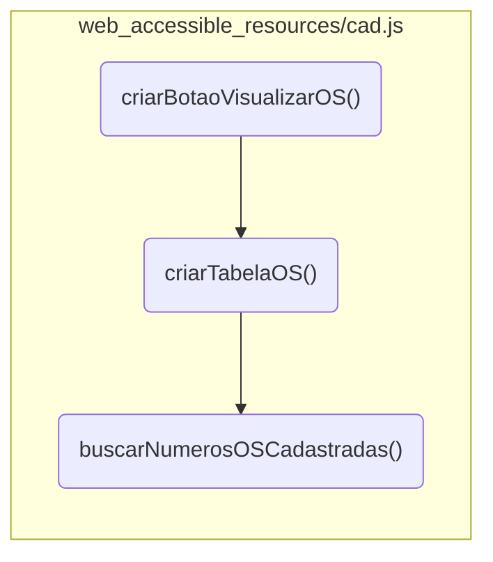
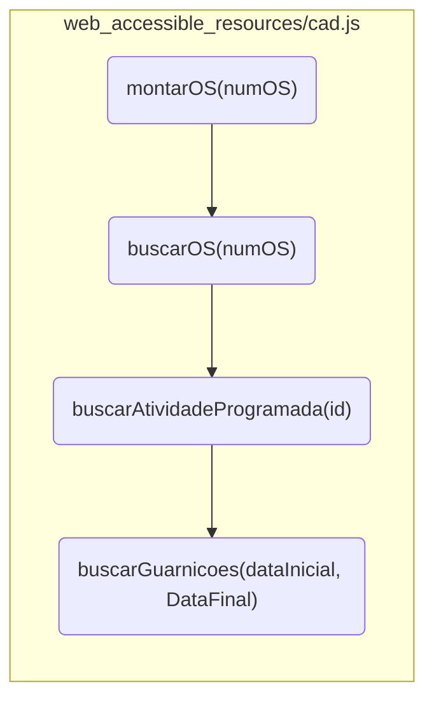

# XCAD GCM-POA

Extensão voltada para automatizar tarefas de diversos sistemas utilizados pela GCM-POA


## Sistemas alcançados

* **Sinesp CAD:** Criação de chamados pré-preenchidos, modelos de relatos e personalização de telas.
* **Consultas Integradas:** Fluxo de consulta automatizado e criação de formulário de resposta resumido.
* **Sentry:** Criação de chamados pré-preenchidos, assistente de correção de boletins, inserção de atividade programadas.


## Como Instalar

### Via Loja Oficial
* [Link para a Chrome Web Store](https://chromewebstore.google.com/detail/fdbjciigbhgllkgplmhmpilgigkdeghg?utm_source=item-share-cb)

### Instalação Manual (Modo Desenvolvedor)
1. Baixe ou clone este repositório:
   ```bash
   git clone https://github.com/DP3D3733/XCAD.git
2. Abra o navegador e acesse a página de extensões:

    - Chrome: chrome://extensions/

3. Ative o Modo do desenvolvedor (no canto superior direito).

4. Clique em Carregar sem compactação (Load unpacked) e selecione a pasta da extensão.

## Tecnologias Utilizadas
- HTML5 / CSS3 / JavaScript
- Manifest V3

## Estrutura
<details>
<summary><b>Ver estrutura de arquivos:</b></summary>

```text
XCAD/
├── assets/                     # Assets utilizados
│   └── icon.png
|
├── popup/                      # Interface de ativação/desativação de scripts
│   ├── popup.html
│   └── popup.js
|
├── background/                 # Scripts em background
│   ├── background.js               # Service Worker
│   └── modules/                    # Módulos de background
│       └── consultas.js                # Fluxo de Consultas Integradas
|
├── content/                    # Scripts da camada de janela
│   ├── content.js                  # Gerencia a injeção de scripts
│   ├── cercamento/                 # Cercamento Eletrônico
│   |   └── loginAutoProcempa.js 
│   |       
│   ├── consultas/                  # Consultas Integradas
│   |   ├── abas_acoes.js               # Acessa os botões nas abas
│   |   ├── cnj.js                      # Recebe e consulta o mandado
│   |   ├── dados_basicos.js            # Lê os dados básicos
│   |   ├── img.js                      # Busca a foto do indiv. e monta a resposta
│   |   ├── inicio.js                   # Pula a tela inicial e retorna ao infoseg
│   |   ├── menu_lateral.js             # Acessa os botões do menu
│   |   ├── ocorrencias.js              # Lê os dados de ocorrências
│   |   ├── pega_nome.js                # Seleciona o indivíduo correto na lista
│   |   ├── pesquisa_nome.js            # Pesquisa o indivíduo
│   |   └── veiculos.js                 # Lê e monta a resposta
│   |   
│   ├── psg_servico/                # Forms de Pass. de Sv do Ch. da Sala
│   |   └── formulario_psg_gs.js        # Preench. rápido e rel. antes de enviar
│   |   
│   ├── sinesp/                     # Sinesp CAD e Infoseg
│   |   ├── discover.js                 # Ajuste em algumas informações
│   |   ├── edicao.js                   # Col. de dados do Sentry e rel. padr.
│   |   ├── equipes.js                  # Preench. rápido de equipes e relatório
│   |   ├── infoseg.js                  # Busca, recebe e monta a resp. consultas
│   |   └── ocorrencias.js              # Funções no CAD Ocorrências
│   |   
│   ├── whatsapp/                   # WhatsApp Web
│   |   └── whatsapp.js    
│   |   
│   └── whu/                        # WHU
│       └── whu.js                      # Notificação de novos chamados
|
├── libs/                       # Bibliotecas externas
│   ├── firebase-app-compat.js      
│   ├── firebase-firestore-compat.js
│   ├── jszip.js
│   └── versiculos.json
|
├── web_accessible_resources/   # Scripts injetados na página
│   ├── atendimento.js              # Sentry - Modelos na pág. de atendimento
│   ├── ba.js                       # Sentry - Assist. Corr. BA
│   ├── cad.js                      # Sentry - Tela do CAD
│   ├── despacho.js                 # Sentry - Copiar Desp. P/ CAD e Ajuste de Hor.
│   ├── despachos.js                # Sentry - Cópia de info padronizadas
│   ├── efetivo.js                  # Sentry - Coleta de efetivo atualizado
│   ├── guarnicoes.js               # Sentry - Cópia de info padronizadas
│   ├── individuo.js                # Sentry - Preench. rápido
│   ├── os.js                       # Sentry - Preench. rápido atividades prog.
│   ├── relatorioPrometa.js         # Sentry - Rel. personalizado
│   └── sentry.js                   # Sentry - Inserção funções compartilhadas
|
└── manifest.json               # Configuração da extensão
```
</details>

## Funções
### Sentry
<details>
<summary>Atualizar Efetivo no Firestore</summary>

1. Usuário faz login no Sentry

2. A função [`sentry.js:atualizarEfetivo()`](https://github.com/DP3D3733/XCAD/blob/main/web_accessible_resources/sentry/sentry.js#L6-L43) em sentry.js baixa o efetivo atualizado e envia ao  Firestore via Background


</details>

<details>
<summary>Buscar OS</summary>

1. Usuário acessa a tela da Central de Atendimento e Despacho do Sentry
2. A função [`criarBotaoVisualizarOS()`](https://github.com/DP3D3733/XCAD/blob/994086df99f11dd847dad3c2787dd4c598b56157/web_accessible_resources/sentry/cad.js#L8-L90):

| Etapa | Ação | Função / Detalhes |
| :---: | :--- | :--- |
| **a** | Interface | Cria o botão que exibe o modal da Ordem de Serviço |
| **b** | Interface | Cria o modal propriamente dito |
| **c** | Estruturação | Chama [`criarTabelaOS()`](https://github.com/DP3D3733/XCAD/blob/994086df99f11dd847dad3c2787dd4c598b56157/web_accessible_resources/sentry/cad.js#L222-L382) para criar a tabela que receberá as demandas |
| **d** | Dados | Popula o seletor de números de OS com [`buscarNumerosOSCadastradas()`](https://github.com/DP3D3733/XCAD/blob/994086df99f11dd847dad3c2787dd4c598b56157/web_accessible_resources/sentry/cad.js#L386-L422) |

    
3. O usuário clica no botão criado pela função [`criarBotaoVisualizarOS()`](https://github.com/DP3D3733/XCAD/blob/994086df99f11dd847dad3c2787dd4c598b56157/web_accessible_resources/sentry/cad.js#L8-L90) e seleciona uma OS no seletor
4. A função [`montarOS(numOS)`](https://github.com/DP3D3733/XCAD/blob/994086df99f11dd847dad3c2787dd4c598b56157/web_accessible_resources/sentry/cad.js#L120-L220) recebe o número da OS que o usuário selecionou e:

| Etapa | Ação | Função Chamada |
| :--- | :--- | :--- |
| **a** | Busca atividades programadas | [`buscarOS(numOS)`](https://github.com/DP3D3733/XCAD/blob/994086df99f11dd847dad3c2787dd4c598b56157/web_accessible_resources/sentry/sentry.js#L207-L231) |
| **b** | Detalha cada atividade | [`buscarAtividadeProgramada(id)`](https://github.com/DP3D3733/XCAD/blob/994086df99f11dd847dad3c2787dd4c598b56157/web_accessible_resources/sentry/sentry.js#L113-L127) |
| **c** | Busca guarnições ativas | [`buscarGuarnicoes(...)`](https://github.com/DP3D3733/XCAD/blob/994086df99f11dd847dad3c2787dd4c598b56157/web_accessible_resources/sentry/cad.js#L424-L455) |
| **d** | Verifica cumprimento | [`buscarAtendimentoAtividadeProgramada(...)`](https://github.com/DP3D3733/XCAD/blob/994086df99f11dd847dad3c2787dd4c598b56157/web_accessible_resources/sentry/cad.js#L457-L471) |
| **e** | Renderização | Insere as demandas na tabela de OS |



</details>

<details>
<summary>Copiar Atendimento P/ Área de transferência</summary>

1. Usuário acessa a tela da Central de Atendimento e Despacho do Sentry
2. A função [`inserirBotaoCopiarAtendimento()`](https://github.com/DP3D3733/XCAD/blob/994086df99f11dd847dad3c2787dd4c598b56157/web_accessible_resources/sentry/cad.js#L473-L487) insere um botão com símbolo de "Copiar" sempre no menu de contexto de um atendimento
3. Ao clicar no botão, a função [`copiarAtendimentoParaWhatsApp(id)`](https://github.com/DP3D3733/XCAD/blob/994086df99f11dd847dad3c2787dd4c598b56157/web_accessible_resources/sentry/cad.js#L820-L890) é disparada:

| Etapa | Ação | Função Chamada |
| :--- | :--- | :--- |
| **a** | Busca o atendimento | [`buscarAtendimento(id)`](https://github.com/DP3D3733/XCAD/blob/994086df99f11dd847dad3c2787dd4c598b56157/web_accessible_resources/sentry/sentry.js#L308-L321) |
| **b** | Formata o retorno |  |
| **c** | Escreve na área de transferência |  |
</details>


